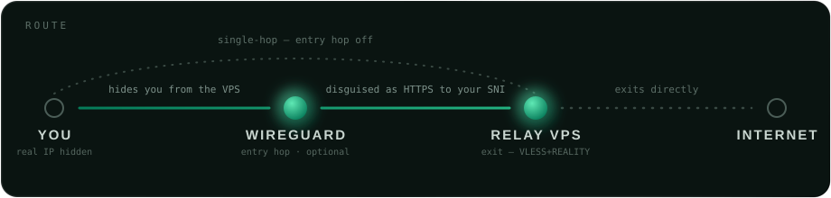

<p align="center">
  
</p>

<h1 align="center">vpn-chain</h1>
<p align="center">
  A layered, censorship-resistant VPN chain, and the tooling around it,
  built as a Kotlin Multiplatform monorepo.
</p>

<p align="center">
  
</p>

A passive observer on your network sees a WireGuard connection to Proton,
never a connection to the relay VPS.

**Contents:** [Layout](#layout) · [Secrets](#secrets) · [Toolchain](#toolchain)
· [Quick start](#quick-start-linux-cli) · [Apps](#apps) · [Releases](#releases)

## Layout

Modules follow [Now in Android](https://github.com/android/nowinandroid)'s
`core` / `feature` / app split, adapted to Kotlin Multiplatform (Koin for DI
instead of Hilt, so `commonMain` works on both Android and desktop).

| Path | What |
|------|------|
| `cli/vpn-chain` | Linux CLI: renders a sing-box config from secrets, drives ProtonVPN + the relay. |
| `cli/import-proton-entry.sh` | Imports a Proton WireGuard `.conf` into `secrets.env`, file-to-file (never prints the key). |
| `cli/killswitch/` | nftables kill-switch helper for desktop's WireGuard-entry-hop mode. |
| `core/model` | KMP data classes: `ChainProfile`, `ChainStatus`, `TunnelState`, `UserSettings`, `LogEntry`. |
| `core/common` | KMP coroutine scope/dispatcher qualifiers, `currentTimeMillis`. |
| `core/logging` | KMP `Logger` facade (Logcat / desktop stderr). |
| `core/config` | KMP `SingBoxConfigFactory` (profile → sing-box JSON) + `SecretsEnvParser`. |
| `core/datastore` | KMP DataStore-backed profile + settings persistence. |
| `core/tunnel` | KMP `TunnelController`: Android `VpnChainService` (libbox), desktop sing-box process; live log flow. |
| `core/data` | KMP repositories: `ChainRepository`, `ProfileRepository`, `SettingsRepository`, `LogRepository`. |
| `core/domain` | KMP use cases (`ConnectChainUseCase`, `ImportProfileUseCase`, …). |
| `core/designsystem` | KMP `VpnChainTheme`, colors/type, `StatusIndicator`. |
| `core/ui` | KMP shared composables (`SectionCard`, theme resolution). |
| `feature/chain` | Connect/disconnect + status (`ChainViewModel`). |
| `feature/settings` | Profile form, secrets.env import, theme picker. |
| `feature/logs` | Live sing-box log viewer. |
| `app-common` | Themed shell: bottom-nav `Scaffold` + `NavHost`, Koin graph aggregation. |
| `androidApp` | Native Android app (Compose + VpnService). |
| `desktopApp` | Compose Multiplatform desktop (Windows/macOS/Linux). |
| `server/` | VPS provisioning, Proton key rotation, link generator. |
| `config-templates/` | sing-box templates + reference configs. |
| `examples/secrets.env.example` | Template for the runtime secret file. |
| `docs/` | Architecture, Android setup, desktop TUN/kill-switch internals, key rotation. |

## Secrets

Real credentials never live in the repo. Copy the example to a locked-down
file **outside** the repo and fill it in:

```
mkdir -p ~/.config/vpn-chain
cp examples/secrets.env.example ~/.config/vpn-chain/secrets.env
chmod 600 ~/.config/vpn-chain/secrets.env
```

The CLI renders an ephemeral sing-box config from it at runtime. The GUI apps
store the profile in DataStore and never write credentials to the repo or the
logs. Populate it in **Settings**, either by importing `secrets.env` or
through the manual form (credential fields are masked).

## Toolchain

Kotlin 2.2.20 · Compose Multiplatform 1.10.0 · AGP 8.13.0 · Gradle 8.13 ·
Koin 4.2.2 · compileSdk/targetSdk 36 (Android 16) · minSdk 26. Versions live in
`gradle/libs.versions.toml`; `build-logic/` holds the convention plugins.

Modules compile to JDK 17 bytecode, but **Gradle 8.13 must _run_ on JDK 17–21**
(not 22+). If your default `java` is newer, point the build at a JDK 21:

```
# gradle.properties (or ~/.gradle/gradle.properties to keep it machine-local)
org.gradle.java.home=/usr/lib/jvm/java-21-openjdk
```

## Quick start (Linux CLI)

```
cli/vpn-chain install       # symlink into ~/.local/bin so `vpn-chain` works anywhere
vpn-chain up                # connect Proton + start the relay
vpn-chain status            # entry path + exit IP
vpn-chain down              # stop the relay (Proton stays up)
```

`install` symlinks the script (override the target dir with
`VPN_CHAIN_BIN_DIR`); `uninstall` removes it.

## Apps

Gradle sync first (fetches SDK components), then `./gradlew :desktopApp:run`
or `./gradlew :androidApp:assembleDebug`. For a wofi/rofi launcher entry:
`./gradlew :desktopApp:installDesktopEntry`.

Both platforms share `app-common` (themed shell, Chain/Logs/Settings bottom
nav) and Koin for DI. Both tunnels are functional:

- **Desktop** runs the `sing-box` binary against a rendered config and
  coexists with the CLI via a shared pidfile. Defaults to system-wide TUN
  routing; see [docs/desktop-tun.md](docs/desktop-tun.md) for setup.
- **Android** runs sing-box in-process via the prebuilt libbox AAR inside a
  `VpnService`, performing both hops itself since Android allows only one
  active VPN. See [docs/android.md](docs/android.md).

**Kill switch:** free, from ProtonVPN's own kill switch, in relay-only mode;
otherwise a narrow nftables helper when a WireGuard entry hop is configured
(setup in [docs/kill-switch.md](docs/kill-switch.md)). Android's is the OS's
own Always-on VPN toggle (details in
[docs/android.md](docs/android.md#kill-switch)).

## Releases

Pushing a `v*` tag runs `.github/workflows/release.yml`: Android release
APKs, a Linux `.deb` + portable `.tar.gz`, a Windows `.msi`, and a macOS
`.dmg` (unsigned), each built on its own native runner. The version lives in
one place, `vpnchain.version` in `gradle.properties`.

```
# bump vpnchain.version (and versionCode for Android updates), then:
git tag v0.1.0 && git push origin v0.1.0
```

Without signing secrets the APKs are debug-signed. For stable signing across
releases, create a keystore and add repo secrets `ANDROID_KEYSTORE_B64`
(`base64 -w0 release.jks`), `ANDROID_KEYSTORE_PASSWORD`, `ANDROID_KEY_ALIAS`,
and `ANDROID_KEY_PASSWORD`:
```
keytool -genkeypair -v -keystore release.jks -alias vpn-chain \
  -keyalg RSA -keysize 4096 -validity 10000
```
